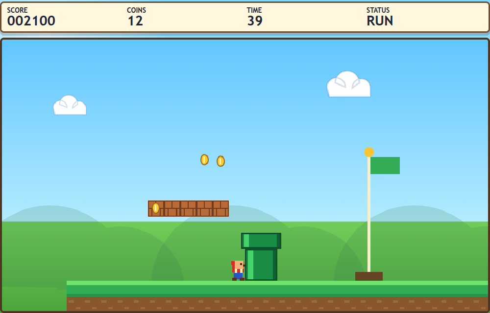
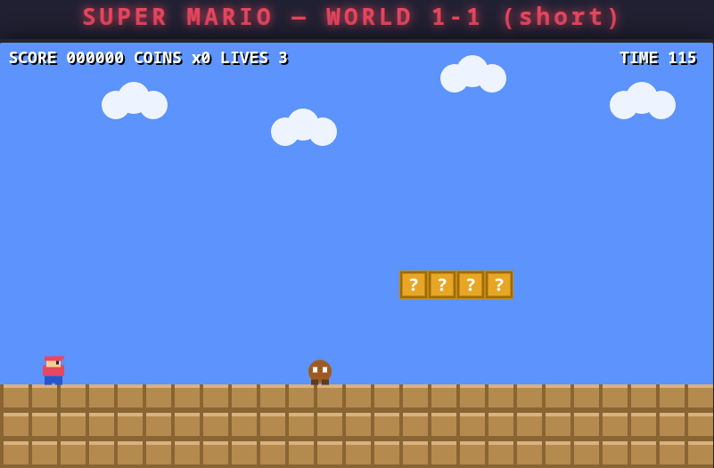

## Run an LLM Locally

- [notes.pdf](./notes.pdf)
- [中文版.pdf](./notes-zh_hans.pdf)


## Mario

Prompt: "please create a fully self-contained super mario game with only one short level, put everything inside mario.html inside the current directory"


### GPT version

[mario-gpt.html](./mario-gpt.html)




### Qwen3.8 version

mario-qwen3.8.html [v1](./mario-qwen3.8.html) [v2](./mario-qwen3.8.v2.html) [v1(bug)](./mario-qwen3.8.v1.html)




## Agenda

1. Install Docker
2. Import Docker images
3. Download a model
4. Run the model
5. Use Pi (optional)


## Install Docker (Sec 2.1)

<div class="docker-list">

- [Docker Desktop Installer.exe](./files/Docker%20Desktop%20Installer.exe) <a class="link-checksum" href="https://desktop.docker.com/win/main/amd64/237512/checksums.txt" target="_blank">checksum</a>
- [Docker Desktop for Mac With Apple silicon](./files/Docker.arm64.dmg) <a class="link-checksum" href="https://desktop.docker.com/mac/main/arm64/237512/checksums.txt" target="_blank">checksum</a>
- [Docker Desktop for Mac With Intel chip](./files/Docker.amd64.dmg) <a class="link-checksum" href="https://desktop.docker.com/mac/main/amd64/237512/checksums.txt" target="_blank">checksum</a>

</div>


### Verify Checksum

<div style="font-size: 0.8em">

- On Windows, open PowerShell, and type `Get-FileHash "Downloads\Docker Desktop Installer.exe" -Algorithm SHA256` and press Enter.
- On Linux / macOS, open terminal, and type `sha256sum ~/Downloads/filename` and press Enter.
- You might need to update the path if you store files in different folders.

</div>


## The Images (Sec 2.2)

For Apple silicons:

- [llama.cpp.arm64](./files/llama.cpp.arm64.tar.gz)
- [pi-docker-image.arm64](./files/pi-docker-image.arm64.tar.gz)

For other computers:

- [llama.cpp](./files/llama.cpp.tar.gz)
- [pi-docker-image](./files/pi-docker-image.tar.gz)


## Import Images (Sec 2.2)

```bash
# Mac with Apple silicon
docker load < llama.cpp.arm64.tar.gz
docker load < pi-docker-image.arm64.tar.gz

# other computers
docker load < llama.cpp.tar.gz
docker load < pi-docker-image.tar.gz
```


## The Models (Sec 2.3)

- [Qwen3-0.6B-UD-Q4_K_XL.gguf](./files/Qwen3-0.6B-UD-Q4_K_XL.gguf)
- [Qwen3-0.6B-UD-IQ1_S.gguf](./files/Qwen3-0.6B-UD-IQ1_S.gguf)
- [Qwen3-0.6B-BF16.gguf](./files/Qwen3-0.6B-BF16.gguf)


## Run the Model (Sec 2.4)

```bash
docker run --rm -it \
  -p 8080:8080 \
  -v "c:\models:/models" \
  ghcr.io/ggml-org/llama.cpp:server \
  -m /models/Qwen3-0.6B-UD-Q4_K_XL.gguf \
  -c 32768 \
  --port 8080
```


## Open the WebUI (Sec 2.4)

Visit http://localhost:8080


## Configuration (Sec 2.5)

Download [models.json](./assets/models.json) and create the folders.

```
$HOME/pi-cfg
└── agent
    └── models.json
```


## Start Pi Container (Sec 2.5)

```bash
docker run --rm -it \
  --add-host=host.docker.internal:host-gateway \
  -v "$HOME/pi-cfg:/root/.pi" \
  ghcr.io/codebar-shanghai/pi-docker-image:latest \
  bash
```


## Run Pi (Sec 2.5)

```bash
# this is the working directory
mkdir helloworld-js

# now enter the working directory
cd helloworld-js

# now start pi
pi
```


## Clean Up (Sec 2.6)

- In the Pi Container, run `/quit` and `exit`
- In the llama.cpp Container, press `Ctrl+C`

```bash
# Remove the images if you don't need them any more
docker image rm ghcr.io/ggml-org/llama.cpp:server
docker image rm ghcr.io/codebar-shanghai/pi-docker-image:latest

# If later you want them back or if you want to update
docker pull ghcr.io/ggml-org/llama.cpp:server
docker pull ghcr.io/codebar-shanghai/pi-docker-image:latest
```
